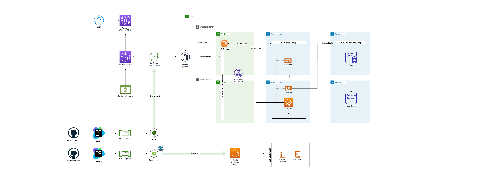

# Realworld E2E DevOps Exercise

Terraform scripts for provisioning a classic 3-tier architecture web application.

---

### Frontend Repo
https://github.com/scotteau/angular-realworld-example-app

### Backend Repo
https://github.com/scotteau/node-express-prisma-v1-official-app

### CI/CD Pipeline
Teamcity + Docker + DockerHub & ECR

- Setup **Teamcity Server** and its agents in docker to watch project repositories for changes. 
- Created **pipeline** consists multiple build steps triggered upon changes.
- Utilised **docker** and **multi-stage build** to generate optimised build artifacts.
- Published docker image automatically to **docker-hub/ECR**.
- Deployed frontend build files automatically to s3 bucket.

### Frontend setup
S3 bucket + CloudFront + Route53

- Created and configured **s3 buckets** for hosting frontend application.
- Created **cloudfront cdn distributions** of the static contents for fast content delivery.
- Configured DNS settings in **Route53** to connect resources together. 
- Created and managed **SSL certificates** in ACM to enable HTTPs connections.

### Backend setup
ECS Fargate + ASG + ALB + Route53 + CloudWatch

- Hosted backend application in **ECS Fargate** environment.
- Setup and configured **ALB** to load balancing traffic to ecs cluster.
- Configured **CloudWatch** and **ASG** to auto-scale the number of containers for high scalability.

### Database setup
RDS Aurora

- Created and configured **RDS Aurora postgres** cluster for storing application data.
- Managed **security groups** and its rules for secured database access.
- Managed secrets in SSM parameter store across multiple components of the application.

---

### TODO
- More tests
- More module examples
- ELK/EFK stack for monitoring
